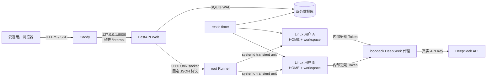

# 系统架构

## 组件关系



Web 服务负责身份、业务状态、排队、事件持久化、配额和代理；它不能直接访问用户 `0700` 目录。Runner 只负责固定的高权限动作。Claude Code 在用户自己的 UID/GID 下运行，而不是以 Web 或 root 身份运行。

## 一条消息的生命周期

1. 浏览器以 Cookie 会话和 CSRF 头提交消息。
2. Web 检查用户是否启用、是否已有活动任务、今日任务和 Token 是否到软上限。
3. 消息及排队任务先写入 SQLite，然后进入全局最多 3 个 worker 的队列。
4. Worker 签发绑定该用户与当前任务、默认最多 1 小时有效的内部代理 Token，经 Runner 启动 transient systemd unit；任务离开 `running` 状态后 Token 立即失效。
5. Runner 通过 stdin 向 `claude --print --input-format text --output-format stream-json` 发送消息。续聊只使用数据库保存的 `--resume <session-id>`，永远不用 `--continue`。固定的 Claude Code 2.1.197 不提供 `--max-turns`，因此 Runner 按 assistant NDJSON 事件实施普通 40 轮、`/scout` 与 `/crossroads` 80 轮上限；systemd 另行实施 15/30 分钟硬超时。
6. Claude 输出 NDJSON；Web 丢弃 thinking，只保存文本、净化工具状态、错误和完成事件。
7. SSE 根据 `seq` 补发事件。浏览器断开不杀进程，重连后可从已持久化序号继续。
8. Claude 调用模型时只能访问 loopback 代理。代理把内部 Token 映射到用户、转发固定 DeepSeek 地址并记录 provider-reported usage。

## 目录布局

```text
/opt/jobhunt/app/                    应用和模板源，只读
/opt/jobhunt/venv/                   Python 虚拟环境，只读
/etc/jobhunt/web.env                 Web 配置和真实 DeepSeek Key
/etc/jobhunt/runner.env              Runner 配置，不含真实 Key
/var/lib/jobhunt/app/                SQLite 数据库
/var/lib/jobhunt/users/<uuid>/
  home/                              Claude 会话与用户 HOME，0700
  workspace/                         独立 Git 仓库，0700
/var/lib/jobhunt-runner/registry.json Runner 注册表，0600
/var/lib/jobhunt-staging/<uuid>/      Web 写入、Runner 导入的临时文件
/run/jobhunt/runner.sock              root:jobhunt-web 0660
```

## 数据模型

- `users`、`web_sessions`、`login_attempts`：账号、会话和登录限速。
- `chats`、`messages`：Web 会话和可见消息。
- `jobs`、`job_events`：队列、运行状态和可重放 SSE。
- `daily_usage`：按用户、自然日记录任务与 provider-reported tokens。
- `files`：上传元数据；真实文件在用户 workspace。
- `audit_logs`：安全与管理动作。

SQLite 在每次连接时启用 `foreign_keys=ON`、WAL 和 `synchronous=NORMAL`。2–4 人规模下，它比额外维护 PostgreSQL 更合适。
